# 🛰️ Disaster Triage AI: Automated Structural Damage Assessment


**Live Dashboard:** [Link]

---

## 📖 Project Overview

I built this end-to-end computer vision and machine learning pipeline to perform rapid structural damage assessment from high-resolution post-disaster satellite imagery. Designed with emergency responders in mind, this tool automatically quantifies structural destruction and highlights critical targets in real time.

Rather than deploying an expensive deep learning model directly to the cloud, the project separates feature extraction, model inference, and visualization into independent stages. This architecture enables fast deployment while remaining compatible with free-tier cloud platforms.

---

## 📸 App Showcase


### Pre-Disaster Baseline


*Archive satellite imagery before the disaster event.*

### Post-Disaster Assessment


*AI assessment highlighting structures with a high probability of total collapse.*

---

# 🏗️ System Architecture

One of the biggest engineering challenges was deployment.

Running TensorFlow inference on high-resolution satellite imagery requires significant memory and computation, which exceeds the limits of most free cloud hosting platforms.

To solve this, the project completely decouples the heavy computer vision pipeline from the user interface.

The TensorFlow feature extraction and XGBoost inference are executed offline. The results are then transformed into a lightweight deployment payload (`showcase.csv`) that contains all required predictions. The Streamlit application simply reads this payload and renders the visualization instantly without running any deep learning model.

## Data Flow

```mermaid
graph TD
    A[Raw xBD Images & Labels] -->|01_batch_extractor.py| B(features.tfrecord)
    B -->|02_xgboost_experiments.ipynb| C{xgboost_classifier.json}

    A -->|03_showcase_curation.py| D[Raw Curated Showcase Images]

    C -->|04_showcase_prep.py| E(showcase.csv Payload)
    D -->|04_showcase_prep.py| E

    D -->|05_optimize_showcase.py| F[Compressed JPGs]

    E -->|app.py| G((Streamlit UI))
    F -->|app.py| G

    style A fill:#262730,stroke:#FAFAFA,stroke-width:1px
    style G fill:#ff4b4b,stroke:#FAFAFA,stroke-width:2px,color:#fff
```



---

# 📁 Repository Structure

To maintain a clean Git history, all raw datasets (approximately **7.8 GB**), intermediate artifacts, notebooks, and heavyweight binaries are excluded from version control. Only the deployment assets and source code required to reproduce the project are tracked.

```text
├── .vscode/                        [gitignored]
├── data/
│   ├── interim/                    [gitignored]
│   ├── processed/
│   │   ├── features.tfrecord       [gitignored]
│   │   ├── metadata.csv            [gitignored]
│   │   └── showcase.csv            # Precomputed Showcase Data
│   ├── raw/
│   │   └── train_data/
│   │       ├── images/             [gitignored]
│   │       └── labels/             [gitignored]
│   └── showcase/                   # Optimized JPGs for Showcase
│
├── models/
│   └── xgboost_classifier.json     # Trained XGBoost model
│
├── notebooks/                      [gitignored]
│
├── src/
│   ├── 01_batch_extractor.py       # TensorFlow ResNet50 feature extraction
│   ├── 02_xgboost_experiments.ipynb# Training, SMOTE & threshold tuning
│   ├── 03_showcase_curation.py     # Curates showcase images
│   ├── 04_showcase_prep.py         # Generates showcase.csv
│   └── 05_optimize_showcase.py     # Converts PNGs into optimized JPGs
│
├── .gitignore
├── app.py                          # Streamlit application
├── Architecture_Log.md             # Engineering design decisions
├── README.md
├── requirements-dev.txt            # Full ML environment
└── requirements.txt                # Lightweight deployment environment
```

---

# 🚀 Using the Live Application

The Streamlit dashboard is designed to simulate a disaster response command center.

### Step 1 — Select an Event

Choose a disaster event (for example, the Palu Tsunami or the Mexico Earthquake) from the sidebar.

### Step 2 — Select a Geographic Sector

Choose one of the available satellite image sectors for analysis.

### Step 3 — Review the Baseline

Inspect the **Pre-Disaster** imagery to understand the original state of the selected neighborhood.

### Step 4 — Run the Assessment

Switch to the **Post-Disaster** view and click **Assess Damage**.

The application loads the precomputed inference payload, draws bounding boxes around every detected structure, and highlights severely damaged buildings in red.

---

# 💻 Local Development

If you'd like to reproduce the complete pipeline, retrain the model, or modify the application, follow the steps below.

## 1. Clone the Repository

```bash
git clone https://github.com/Shailya777/disaster_triage_pipeline.git
cd disaster-triage-pipeline
```

---

## 2. Install Dependencies

The project separates development and deployment dependencies.

### Option A — UI Only

If you only want to run the Streamlit application using the precomputed inference payload:

```bash
pip install -r requirements.txt
streamlit run app.py
```

---

### Option B — Full Machine Learning Pipeline

If you want to:

- retrain the XGBoost classifier,
- execute the TensorFlow feature extraction pipeline,
- run the notebooks, or
- regenerate the deployment payload,

install the full development environment:

```bash
pip install -r requirements-dev.txt
```

> **Note**
>
> To execute the extraction pipeline, you must manually download the xBD dataset (Challenge Training Set, ~ 7.8 GB) and place it inside:
>
> ```text
> data/raw/
> ```

---

# 👤 Author

**Shailya Gandhi**